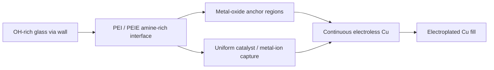
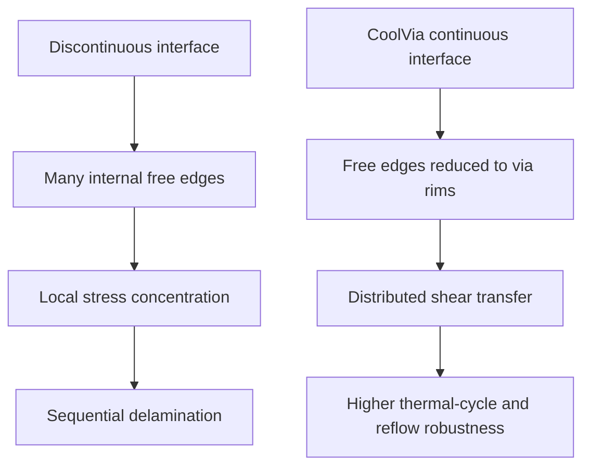

# CoolVia™ — PEI/PEIE Continuous Metallization Interface for Glass Substrates

> **A through-glass via can be completely filled with copper and still fail.**  
> CoolVia addresses the real bottleneck: discontinuity at the glass–metal interface.

[한국어](README_KO.md) | [中文](README_ZH.md)

## 1. What CoolVia is

CoolVia is a wet-process interface platform for through-glass vias (TGVs) and glass-core substrates. It uses **polyethyleneimine (PEI)** and **ethoxylated polyethyleneimine (PEIE)** to create an amine-rich bridge between glass, metal-oxide anchor regions, catalytic nuclei, and the final copper layer.

It is not a molten-glass process, not a via-drilling method, and not merely a copper-plating recipe. It is a **continuous-interface technology** that can be inserted ahead of sputter seed, electroless copper, or bottom-up electroplating.

## 2. The industry problem

Conventional TGV metallization often produces locally separated regions:

- glass / metal-oxide anchor / catalyst / electroless Cu / electroplated Cu
- bare glass / mechanically contacting Cu

Cross-sections or X-ray computed tomography may show a fully filled via, while hidden unbonded channels remain along the via wall. Under thermal cycling or reflow, every discontinuity becomes a free edge where local delamination can initiate.

**The critical variable is not average adhesion strength. It is the maximum connected unbonded length along the via wall.**

## 3. CoolVia interface architecture

### Metal-oxide anchor

A nanoscale ZnO, TiO₂, SnO₂, or Al₂O₃ anchor layer provides an inorganic load-transfer path close to the coefficient of thermal expansion of glass.

### PEI amine bridge

Primary, secondary, and tertiary amines form multipoint adsorption on silanol-rich glass and oxide surfaces. Exposed nitrogen lone pairs coordinate Pd or Cu ions and increase nucleation-site density.

### PEIE wetting and coating uniformity

Ethoxylated chains improve aqueous wetting and suppress coating-thickness variation inside fine and high-aspect-ratio TGVs.

### Continuous copper film

The electroless Cu layer connects separated oxide anchor islands into one metallic body and blocks wet chemistry from attacking exposed anchor edges.

## 4. Three insertion routes

| Route | Process position | Main purpose |
|---|---|---|
| **CoolVia S** | PEI/PEIE primer before Ti/TiN sputter | Lowers the continuous-film threshold and improves initial adhesion in middle and lower via regions |
| **CoolVia W** | Wet anchor + amine bridge + electroless Cu | Removes directional PVD coverage dependence and creates a conformal seed interface |
| **CoolVia F** | Continuous seed combined with a lower Cu feeding foil | Enables controlled bottom-up electroplating while preserving wall adhesion |

The routes are complementary. A representative architecture uses **CoolVia W for the continuous seed interface and CoolVia F for bottom-up filling**.

## 5. Why PEI/PEIE changes reliability

The PEI/PEIE layer is not intended to become a thick polymer adhesive. It remains an ultrathin molecular interface that:

1. bridges oxide-uncovered glass regions,
2. makes catalyst capture spatially uniform,
3. accelerates coalescence of electroless Cu nuclei,
4. eliminates connected weak channels,
5. preserves low glass-wall roughness for high-frequency signal integrity.

## 6. Representative process window

| Step | Representative starting condition |
|---|---|
| Glass preparation | HF treatment followed by sufficient deionized-water rinse; retain an OH-rich surface |
| Metal-oxide anchor | 5–20 nm target thickness; control morphology to keep wall roughness **Ra ≤ 30 nm** |
| PEI/PEIE bridge | Total active concentration approximately **0.02–0.10 wt%** |
| Representative PEI:PEIE ratio | **70:30** starting composition |
| Bridge treatment | Static immersion 3–5 min or through-flow treatment 1–2 min |
| Drying/fixation | 120–150 °C for 5–15 min |
| Electroless Cu | Low-alkaline bath, approximately pH 9.5–11; continuous film 0.3–0.8 μm |
| Electroplating | Initial low-current stage followed by controlled bulk fill |

The optimum window depends on glass chemistry, via diameter, aspect ratio, oxide selection, catalyst chemistry, and electroless bath.

## 7. Engineering targets

| Metric | Conventional discontinuous interface | CoolVia target |
|---|---:|---:|
| Maximum connected unbonded length | 200–400 μm | 2–10 μm |
| Thermal cycling, −55 to +125 °C, 1,000 cycles | Resistance drift and intermittent opens possible | ΔR within ±3%, zero intermittent opens target |
| 90° peel strength at low roughness | 0.2–0.4 kgf/cm | 0.7–1.1 kgf/cm target |
| MSL3 / 260 °C ×3 reflow | Connected delamination path possible | Zero delamination target |
| Via resistance coefficient of variation | 8–20% | 3–5% target |
| Wall roughness | Frequently raised to obtain mechanical anchoring | Ra ≤ 30 nm target |

These values are engineering targets and model-based predictions to be verified through customer-specific design of experiments and qualification testing.

## 8. Process-gate concept

| Gate | Inspection point | Acceptance direction |
|---|---|---|
| G0 | After oxide-anchor formation | Coverage uniformity and Ra ≤ 30 nm |
| G1 | After PEI/PEIE treatment | Increased and uniform N 1s signal; molecular-scale layer |
| G2 | After electroless Cu | Continuous film, low sheet resistance, no pinholes |
| G3 | After via filling | Maximum connected unbonded length ≤ 10 μm; no seam or void |
| G4 | Qualification | Thermal cycling, peel, and reflow criteria satisfied |

## 9. Strategic value for glass-core substrates

Glass is selected for dimensional stability and low high-frequency loss. Increasing surface roughness to gain adhesion sacrifices this advantage. CoolVia targets strong interfacial continuity **without converting the glass wall into a rough mechanical-locking surface**.

This makes the platform relevant to:

- glass-core substrates,
- through-glass interposers,
- high-bandwidth-memory packaging,
- chiplet and co-packaged-optics substrates,
- microelectromechanical-system glass feedthroughs,
- high-aspect-ratio wet metallization lines.

## 10. Core proposition

> **Filling a via and securing reliability are different events.**  
> CoolVia converts isolated adhesion islands into a continuous glass–metal load-transfer interface using a metal-oxide anchor and a PEI/PEIE amine bridge.

---

**Cools Co., Ltd.**  
Process Chemistry for Advanced Metallization  
Technology: CoolVia™ / CoolSeed™ / CoolSputter™
