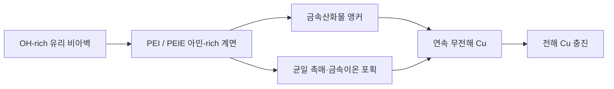
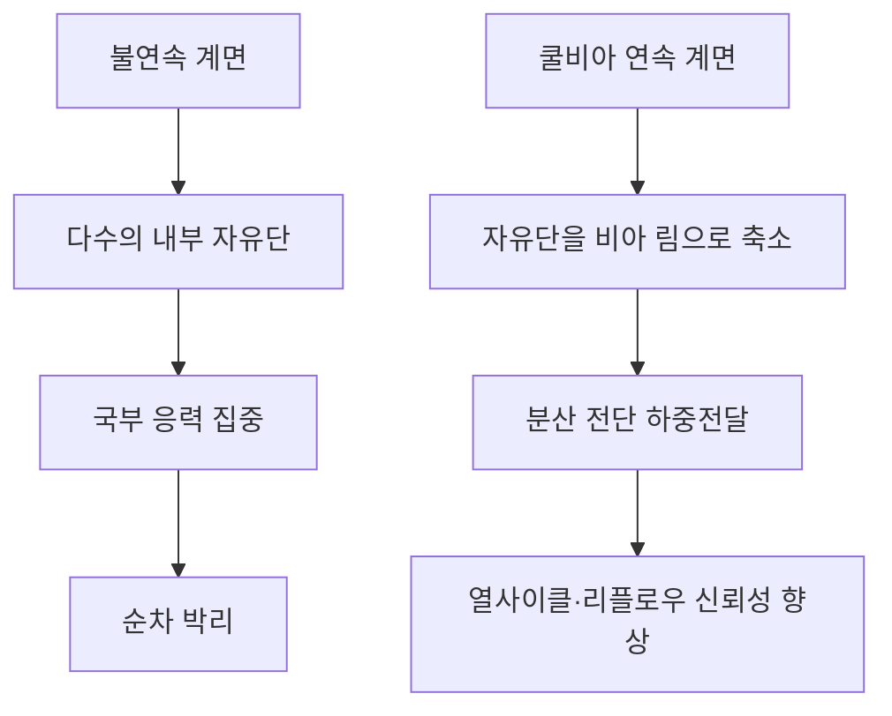

# 쿨비아 CoolVia™ — PEI/PEIE 기반 글라스 기판 연속 금속계면 플랫폼

> **비아를 구리로 완전히 채우는 것과 신뢰성을 확보하는 것은 다른 사건입니다.**  
> 쿨비아는 유리–금속 계면의 불연속이라는 실제 병목을 해결합니다.

[English](README.md) | [中文](README_ZH.md)

## 1. 쿨비아의 정의

쿨비아는 관통 유리 비아(Through-Glass Via, TGV)와 글라스 코어 기판을 위한 습식 계면 플랫폼입니다. **폴리에틸렌이민(Polyethyleneimine, PEI)**과 **에톡실화 폴리에틸렌이민(Ethoxylated Polyethyleneimine, PEIE)**을 이용하여 유리, 금속산화물 앵커, 촉매 핵, 최종 구리막 사이에 아민-rich 연결 계면을 형성합니다.

이 기술은 용융글라스 공정도 아니고, 비아 천공법도 아니며, 단순한 구리 도금 레시피도 아닙니다. 스퍼터 시드, 무전해 구리 또는 바텀업 전해도금 앞단에 삽입되는 **연속 계면 기술**입니다.

## 2. 산업적 병목

종래 TGV 금속화에서는 비아벽에 다음 두 영역이 혼재하기 쉽습니다.

- 유리 / 금속산화물 앵커 / 촉매 / 무전해 Cu / 전해 Cu
- 노출 유리 / 단순 접촉 Cu

단면 또는 X-ray CT에서 비아가 완전히 충진된 것으로 보여도, 비아벽을 따라 연결된 미접착 채널이 숨어 있을 수 있습니다. 열사이클 또는 리플로우 시에는 계면 단절부마다 자유단이 형성되고, 그 지점에서 박리가 개시됩니다.

**핵심 지표는 평균 접착강도가 아니라 비아벽을 따라 서로 연결된 미접착 영역의 최대 길이입니다.**

## 3. 쿨비아 계면 구조

### 금속산화물 앵커

ZnO, TiO₂, SnO₂ 또는 Al₂O₃ 나노 앵커는 유리와 열팽창계수가 가까운 무기–무기 하중전달 경로를 제공합니다.

### PEI 아민 브리지

1차·2차·3차 아민기는 실라놀-rich 유리와 산화물 표면에 다점 흡착합니다. 표면에 노출된 질소의 비공유 전자쌍은 Pd 또는 Cu 이온을 배위 포획하여 핵생성 밀도를 높입니다.

### PEIE 젖음성과 도포 균일성

에톡실 사슬은 수계 젖음성을 개선하고 미세·고종횡비 TGV 내부의 흡착층 두께 편차를 억제합니다.

### 연속 구리막

무전해 Cu 연속막은 서로 떨어진 산화물 앵커를 하나의 금속체로 묶고, 후속 습식액이 앵커 단절부로 침투하는 경로를 차단합니다.

## 4. 세 가지 적용축

| 적용축 | 공정 위치 | 주된 역할 |
|---|---|---|
| **CoolVia S** | Ti/TiN 스퍼터 전 PEI/PEIE 프라이머 | 비아 중·하부의 초기 부착과 연속막 형성 임계두께 개선 |
| **CoolVia W** | 습식 앵커 + 아민 브리지 + 무전해 Cu | 방향성 물리기상증착(PVD) 커버리지 의존성을 제거하고 컨포멀 시드 형성 |
| **CoolVia F** | 연속 시드와 하부 Cu 급전 포일 결합 | 비아벽 접착을 유지하면서 바텀업 전해 충진 구현 |

세 축은 배타적이지 않습니다. 대표 구성은 **CoolVia W로 연속 시드 계면을 형성한 뒤 CoolVia F로 바텀업 충진**하는 방식입니다.

## 5. PEI/PEIE가 신뢰성을 바꾸는 이유

PEI/PEIE는 두꺼운 고분자 접착층으로 남는 것이 아닙니다. 분자 수준의 초박막 계면으로 작동하며 다음을 수행합니다.

1. 산화물 미피복 유리 구간을 연결합니다.
2. 촉매 포획 밀도를 공간적으로 균일화합니다.
3. 무전해 Cu 핵의 합체 임계두께를 낮춥니다.
4. 연결된 약상 채널을 제거합니다.
5. 고주파 손실에 유리한 저조도 유리벽을 보존합니다.

## 6. 대표 공정창

| 공정 | 대표 시작 조건 |
|---|---|
| 유리 표면 준비 | HF 처리 후 충분한 탈이온수(DI) 린스, OH-rich 표면 유지 |
| 금속산화물 앵커 | 목표 두께 5–20 nm, 벽면 조도 **Ra ≤ 30 nm** 유지 |
| PEI/PEIE 브리지 | 총 활성성분 약 **0.02–0.10 wt%** |
| 대표 PEI:PEIE 비율 | 시작 조성 **70:30** |
| 브리지 처리 | 정지욕 3–5분 또는 관통 플로우 1–2분 |
| 건조·고정 | 120–150 °C, 5–15분 |
| 무전해 Cu | 저알칼리 욕 pH 약 9.5–11, 연속막 0.3–0.8 μm |
| 전해 충진 | 초기 저전류 후 본 도금 전류로 단계 상승 |

최적 공정창은 유리 조성, 비아 직경, 종횡비, 산화물 종류, 촉매 및 무전해 욕에 따라 조정됩니다.

## 7. 공학적 목표값

| 지표 | 종래 불연속 계면 | 쿨비아 목표 |
|---|---:|---:|
| 최대 연결 미접착 길이 | 200–400 μm | 2–10 μm |
| −55~+125 °C, 1,000회 열사이클 | 저항 증가 및 순간 개방 가능 | ΔR ±3% 이내, 순간 개방 0건 목표 |
| 저조도 조건 90° 필 강도 | 0.2–0.4 kgf/cm | 0.7–1.1 kgf/cm 목표 |
| MSL3 / 260 °C ×3 리플로우 | 연결 박리 경로 발생 가능 | 델라미네이션 0건 목표 |
| 비아 저항 변동계수 | 8–20% | 3–5% 목표 |
| 비아벽 조도 | 접착을 위해 조도 증가에 의존 | Ra ≤ 30 nm 목표 |

위 수치는 고객별 실험계획법(Design of Experiments, DOE)과 승인시험으로 검증할 공학적 목표 및 물리모델 예측값입니다.

## 8. 공정 게이트

| 게이트 | 확인 시점 | 판정 방향 |
|---|---|---|
| G0 | 산화물 앵커 형성 후 | 피복 균일성 및 Ra ≤ 30 nm |
| G1 | PEI/PEIE 처리 후 | 균일한 N 1s 신호 증가, 분자 수준 계면층 |
| G2 | 무전해 Cu 후 | 연속막, 낮은 시트저항, 핀홀 없음 |
| G3 | 전해 충진 후 | 최대 연결 미접착 길이 ≤ 10 μm, seam·보이드 없음 |
| G4 | 승인시험 | 열사이클·필·리플로우 기준 충족 |

## 9. 글라스 코어 기판에서의 전략적 가치

글라스 기판은 치수 안정성과 낮은 고주파 손실 때문에 채택됩니다. 접착 확보를 위해 표면조도를 크게 올리면 글라스 채택의 장점을 스스로 훼손합니다. 쿨비아는 유리벽을 거친 기계적 인터로킹 표면으로 만들지 않고도 계면 연속성을 확보하는 것을 목표로 합니다.

적용 분야는 다음과 같습니다.

- 글라스 코어 기판
- 관통 유리 인터포저
- 고대역폭메모리(High Bandwidth Memory, HBM) 패키징
- 칩렛 및 공동패키지광학(Co-Packaged Optics, CPO) 기판
- 미세전자기계시스템(Microelectromechanical System, MEMS) 유리 관통전극
- 고종횡비 습식 금속화 라인

## 10. 핵심 명제

> **비아 충진과 신뢰성 확보는 서로 다른 사건입니다.**  
> 쿨비아는 금속산화물 앵커와 PEI/PEIE 아민 브리지를 이용하여 분리된 접착 섬을 연속 유리–금속 하중전달 계면으로 전환합니다.

---

**㈜쿨스 Cools Co., Ltd.**  
Process Chemistry for Advanced Metallization  
Technology: CoolVia™ / CoolSeed™ / CoolSputter™
