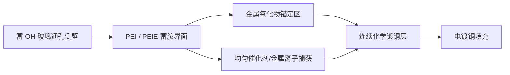
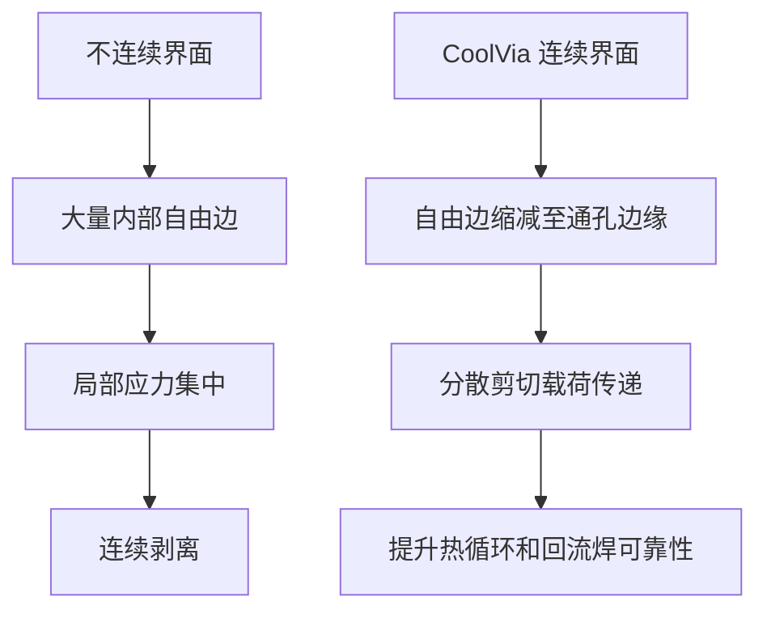

# CoolVia™ — 基于 PEI/PEIE 的玻璃基板连续金属界面平台

> **通孔被铜完全填满，并不等于可靠性已经得到保证。**  
> CoolVia 解决的是玻璃—金属界面不连续这一真正的瓶颈。

[English](README.md) | [한국어](README_KO.md)

## 1. CoolVia 的定义

CoolVia 是面向玻璃通孔（Through-Glass Via，TGV）和玻璃芯基板的湿法界面平台。该平台利用**聚乙烯亚胺（Polyethyleneimine，PEI）**和**乙氧基化聚乙烯亚胺（Ethoxylated Polyethyleneimine，PEIE）**，在玻璃、金属氧化物锚定区、催化核和最终铜层之间形成富胺桥接界面。

该技术不是熔融玻璃工艺，不是通孔加工方法，也不只是铜电镀配方。它是一种可插入溅射种子层、化学镀铜或自下而上电镀之前的**连续界面技术**。

## 2. 产业瓶颈

传统 TGV 金属化中，通孔侧壁容易同时存在两类区域：

- 玻璃 / 金属氧化物锚定层 / 催化剂 / 化学镀铜 / 电镀铜
- 裸露玻璃 / 仅机械接触的铜

即使截面或 X-ray CT 显示通孔已完全填充，侧壁仍可能存在相互连通的未粘接通道。在热循环或回流焊过程中，每个界面断点都会成为自由边，并从该位置启动局部剥离。

**关键指标不是平均粘接强度，而是沿通孔侧壁相互连通的最大未粘接长度。**

## 3. CoolVia 界面结构

### 金属氧化物锚定层

ZnO、TiO₂、SnO₂ 或 Al₂O₃ 纳米锚定层提供与玻璃热膨胀系数接近的无机—无机载荷传递路径。

### PEI 胺桥

伯胺、仲胺和叔胺可在富硅醇玻璃及氧化物表面形成多点吸附。暴露的氮孤对电子能够配位捕获 Pd 或 Cu 离子，从而提高成核密度。

### PEIE 润湿与涂布均匀性

乙氧基链改善水系润湿性，并降低微细、高深宽比 TGV 内部吸附层的厚度偏差。

### 连续铜膜

连续化学镀铜层把彼此分离的氧化物锚定岛连接成一个金属整体，同时阻断后续湿法药液从界面断点侵蚀锚定层的通道。

## 4. 三种导入路径

| 路径 | 工艺位置 | 主要作用 |
|---|---|---|
| **CoolVia S** | Ti/TiN 溅射前的 PEI/PEIE 底涂 | 改善通孔中下部的初始附着和连续成膜临界厚度 |
| **CoolVia W** | 湿法锚定层 + 胺桥 + 化学镀铜 | 消除对方向性物理气相沉积覆盖率的依赖，形成共形种子界面 |
| **CoolVia F** | 连续种子层与底部铜供电箔结合 | 在保持侧壁附着的同时实现自下而上电镀填充 |

三种路径并不互斥。代表性组合是先利用 **CoolVia W 构建连续种子界面，再利用 CoolVia F 进行自下而上填充**。

## 5. PEI/PEIE 改变可靠性的原因

PEI/PEIE 并不是作为厚聚合物胶层存在，而是形成分子尺度的超薄界面，其功能包括：

1. 跨接氧化物未覆盖的玻璃区域；
2. 均匀化催化剂捕获密度；
3. 降低化学镀铜成核岛合并所需的临界厚度；
4. 消除相互连通的弱界面通道；
5. 保持有利于高频传输的低粗糙度玻璃侧壁。

## 6. 代表性工艺窗口

| 工序 | 代表性起始条件 |
|---|---|
| 玻璃表面准备 | HF 处理后充分去离子水清洗，保持富 OH 表面 |
| 金属氧化物锚定层 | 目标厚度 5–20 nm，侧壁粗糙度保持 **Ra ≤ 30 nm** |
| PEI/PEIE 胺桥 | 总有效成分约 **0.02–0.10 wt%** |
| 代表性 PEI:PEIE 比例 | 起始配比 **70:30** |
| 胺桥处理 | 静态浸泡 3–5 分钟，或贯通流处理 1–2 分钟 |
| 干燥固定 | 120–150 °C，5–15 分钟 |
| 化学镀铜 | 低碱性镀液，pH 约 9.5–11；连续膜厚 0.3–0.8 μm |
| 电镀填充 | 初期低电流后逐步升至主体填充电流 |

最佳窗口需根据玻璃成分、孔径、深宽比、氧化物种类、催化剂体系和化学镀液进行调整。

## 7. 工程目标

| 指标 | 传统不连续界面 | CoolVia 目标 |
|---|---:|---:|
| 最大连通未粘接长度 | 200–400 μm | 2–10 μm |
| −55~+125 °C、1,000 次热循环 | 可能出现电阻漂移和瞬时开路 | ΔR 控制在 ±3% 内，瞬时开路 0 次目标 |
| 低粗糙度条件下 90° 剥离强度 | 0.2–0.4 kgf/cm | 0.7–1.1 kgf/cm 目标 |
| MSL3 / 260 °C ×3 回流焊 | 可能形成连通剥离路径 | 0 脱层目标 |
| 通孔电阻变异系数 | 8–20% | 3–5% 目标 |
| 通孔侧壁粗糙度 | 常依赖提高粗糙度获得机械咬合 | Ra ≤ 30 nm 目标 |

上述数值是需通过客户专用实验设计（Design of Experiments，DOE）和认证测试验证的工程目标及物理模型预测值。

## 8. 工艺门控

| 门控 | 检查时点 | 判定方向 |
|---|---|---|
| G0 | 氧化物锚定层形成后 | 覆盖均匀，Ra ≤ 30 nm |
| G1 | PEI/PEIE 处理后 | N 1s 信号均匀增加，保持分子尺度界面层 |
| G2 | 化学镀铜后 | 连续膜、低方阻、无针孔 |
| G3 | 电镀填充后 | 最大连通未粘接长度 ≤ 10 μm，无接缝和空洞 |
| G4 | 认证测试 | 满足热循环、剥离和回流焊标准 |

## 9. 对玻璃芯基板的战略价值

玻璃基板因尺寸稳定性和低高频损耗而被采用。为了获得附着力而大幅提高表面粗糙度，会削弱玻璃本身的采用价值。CoolVia 的目标是在不把玻璃侧壁变成粗糙机械咬合表面的情况下，实现强而连续的界面。

适用领域包括：

- 玻璃芯基板；
- 玻璃通孔中介层；
- 高带宽存储器（High Bandwidth Memory，HBM）封装；
- Chiplet 与共同封装光学（Co-Packaged Optics，CPO）基板；
- 微机电系统（Microelectromechanical System，MEMS）玻璃贯穿电极；
- 高深宽比湿法金属化产线。

## 10. 核心主张

> **通孔填充与可靠性保证是两个不同事件。**  
> CoolVia 通过金属氧化物锚定层和 PEI/PEIE 胺桥，把分散的粘接岛转换为连续的玻璃—金属载荷传递界面。

---

**Cools Co., Ltd.**  
Process Chemistry for Advanced Metallization  
Technology: CoolVia™ / CoolSeed™ / CoolSputter™
