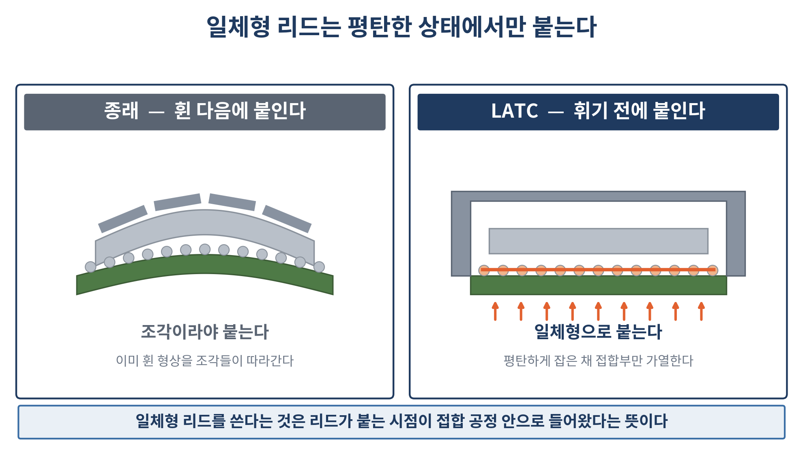
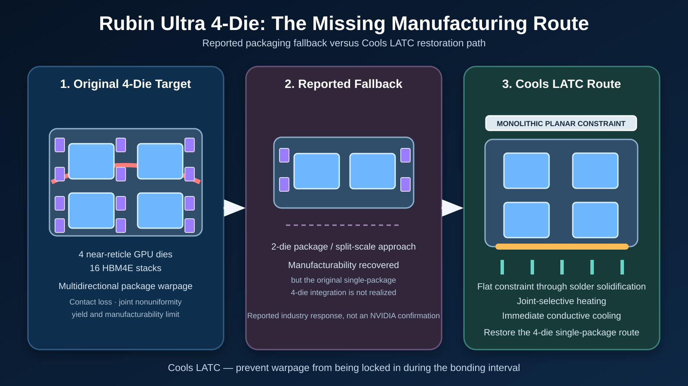

# LATC — Large Area Thermal Clutch

**Large-area advanced-packaging bonding architecture integrating planar constraint, joint-selective heating, solder solidification, and immediate conductive cooling.**

[한국어](README_KR.md) · [中文](README_ZH.md)

## Rubin Ultra 4-die-class application

**LATC provides a manufacturing route for restoring a single-package four-compute-die architecture at a scale where conventional large-area bonding can become limited by multidirectional warpage, local contact loss, and solder-joint nonuniformity.**

Industry reporting has associated an originally discussed four-die Rubin Ultra-class configuration with extreme-scale packaging and manufacturability constraints, while NVIDIA has not publicly confirmed warpage as the reason for any architecture change. Cools therefore presents this as an engineering application scenario based on reported industry information—not as a statement of NVIDIA's confidential process history.

LATC maintains monolithic planar constraint through solder solidification, heats the bonding interface selectively, and switches immediately to high-speed conductive cooling. The objective is to prevent the four-die package geometry from being locked into a warped state.

**Technical note:** [Rubin Ultra 4-Die-Class Packaging: A LATC Process Route](briefs/Rubin_Ultra_4Die_LATC_EN.md)

## What LATC changes

Large-area interposer-to-substrate bonding is constrained by warpage generated during heating and cooling. Once solder solidifies, that deformation becomes locked into the package.

LATC changes the sequence itself:

1. The package is held flat by a monolithic lid or stiffening member.
2. Energy is delivered selectively to the bonding interface.
3. Immediately after solidification, the thermal path is switched to high-speed conductive cooling.

The objective is not to flatten a package after warpage has formed. It is to prevent warpage from being locked in during the bonding interval.

## Why the monolithic lid matters

A segmented lid can follow an already warped package because each segment can move independently. A monolithic lid cannot absorb the curvature component in the same way.

Cools therefore assesses that adoption of a monolithic lid is a strong indication that lid attachment has moved from a post-bonding operation into the bonding process itself.

## TSMC and the observed architecture

Publicly reported TSMC large-area package structures indicate a transition toward a monolithic lid architecture.

Cools assesses that this change is difficult to reconcile with a process in which the lid is attached only after joint solidification. If the actual process attaches the lid during the bonding interval, the resulting process architecture may overlap with the bonding-sequence and thermal-path architecture claimed by Cools.

This is an engineering inference based on publicly observable structure. It is not a confirmation of TSMC's non-public process sequence.

## Cools patent position

Cools has established three related patent families covering:

- pre-solidification joining of the stiffening member;
- wavelength-selective joint heating through the underside of the substrate; and
- the integrated process combining both elements.

These families comprise **150 claims**. An adjacent thermal-path-switching and pressurized-cooling portfolio comprises **4 filings and 137 claims**.

## Adjacent glass-substrate platform — CoolVia

Cools has also published a separate technical overview of **PEI/PEIE-based continuous metallization interfaces for through-glass vias and glass-core substrates**. This platform excludes molten-glass manufacturing and focuses on wet-process interface continuity, low-roughness adhesion, electroless copper seeding, and bottom-up filling.

- [CoolVia English technical overview](CoolVia_PEIE_PEI_Glass_Substrate/README.md)
- [CoolVia Korean technical overview](CoolVia_PEIE_PEI_Glass_Substrate/README_KO.md)
- [CoolVia Chinese technical overview](CoolVia_PEIE_PEI_Glass_Substrate/README_ZH.md)

## Global collaboration

Cools plans to pursue technical review and joint-development discussions with Samsung Electronics, Intel, other global semiconductor and advanced-packaging companies, and relevant companies in China.

Potential engagement structures include patent licensing, process architecture transfer, and joint process development.

## Public technical briefs

- [Rubin Ultra 4-die LATC technical note](briefs/Rubin_Ultra_4Die_LATC_EN.md)
- [Korean public position brief](briefs/Cools_LATC_Public_Position_Brief_KR.docx)
- [English public position brief](briefs/Cools_LATC_Public_Position_Brief_EN.docx)
- [Chinese technical summary](briefs/Cools_LATC_Public_Position_Summary_ZH.md)

## Figures

- [Rubin Ultra 4-die LATC process route](assets/Rubin_Ultra_4Die_LATC_process_route.svg)
- [Monolithic-lid concept](assets/LATC_monolithic_lid_concept_KR.png)
- [Three-step press figure](assets/LATC_three_step_press_figure_KR.png)
- [Conventional process versus LATC](assets/LATC_process_comparison_KR.png)

## Contact

**Dr. Jinhyun Cho — Founder & CEO, Cools Inc.**  
Email: [jhcho@cools.co.kr](mailto:jhcho@cools.co.kr)

For technical review, press enquiries, licensing, or joint development, please contact Cools directly by email. Messages may also be left through [GitHub Issues](https://github.com/jhcho9494/Cools_CoWos_No_WarpageSolution/issues).

## Notice

Publication of this repository does not grant any licence, implied right, or permission to practise the disclosed technology. All patent rights, pending application rights, technical materials, figures, and associated commercial rights are reserved by Cools Inc.

© 2026 Cools Inc. All rights reserved.